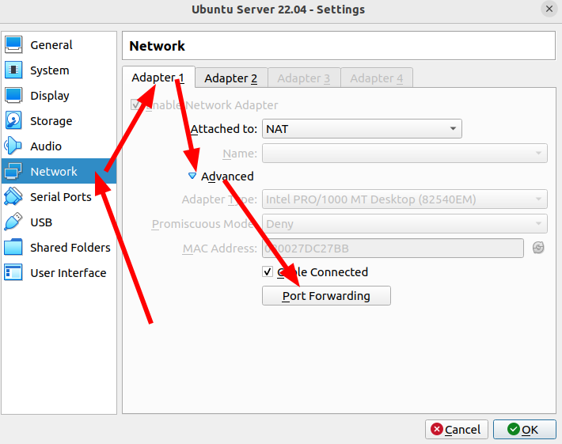
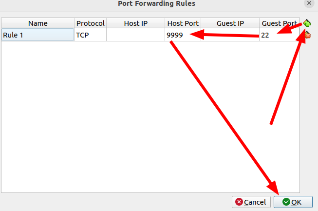

# SSH lab

Aangezien de virtuele machines Ubuntu Desktop zijn, en niet Ubuntu Server, hebben deze standaard geen SSH server geïnstalleerd. Enkel een SSH client. Open alle virtuele machines en voer volgende commando's uit in iedere virtuele machine om de SSH server overal te installeren.

```shell
sudo apt update
sudo apt install openssh-server
sudo systemctl enable ssh
sudo systemctl start ssh
```

> Tip: gebruik `ctrl`-`shift`-`v` om te plakken in een Linux terminal en `ctrl`-`shift`-`c` om te kopiëren van een Linux terminal. Vergeet niet om clipboard aan te zetten in de settings van je VM.

## Resources

* [SSH Client and SCP cheatsheet](https://quickref.me/ssh.html)
* [`sshd_config` reference](https://linux.die.net/man/5/sshd_config)
* [`ssh` reference](https://linux.die.net/man/1/ssh)

## Turn off password authentication

To turn off the password authentication you have to make change in th esshd_config file.

To make changes in this file simply run the command:
- ```sudo nano /etc/ssh/sshd_config```

In this file you will see tons of configuration, but you only need to chane one word in the line:

- ```#PasswordAuthentication yes```

Simply change the ```yes``` to ```no``` and remove the ```#```.

Als eerste opdracht zet je op iedere VM wachtwoord authenticatie uit.

## Public Key Authentication

Authenticatie met wachtwoord is zeer gevaarlijk, daarom wordt dit niet gebruikt in dit labo. Iedere server waarvan de SSH poort openstaat krijgt constant login pogingen die wachtwoorden proberen te brute forcen. Daardoor staat op bijna alle besturingssystemen wachtwoord authenticatie standaard uit. Dit zet je best nooit aan.

> ❓ Echter, Public Key Authenticatie kan nog steeds gevaarlijk zijn. Stel dat je een keypair gebruikt met RSA en een sleutelgrootte van 1024 bits. Is dit een veilige keuze? Waarom wel of niet?

```txt
Een RSA-sleutel van 1024 bits kan met moderne hardware relatief snel worden gekraakt.
- De beveiliging van RSA hangt af van hoe moeilijk het is om een groot getal te ontbinden in priemfactoren.
- Dankzij technologische vooruitgang (snellere computers en betere algoritmens) is 1024-bit RSA tegenwoordig niet meer voldoende, het is kwetsbaar voor goed uitegruste aanvallers.

Aanbevolen minimum
- De huidige minimale veilige lengte voor RSA is 2048 bits.
- Voor lange termijnbeveiliging (meer dan 10 jaar) raadt men zelfd 4096 buts aan.

Alternatief: moderne algoritmes
- In plaats van RSA kun je beter elliptische-curvevryptografie (ECC) gebruiken:
  - Bijvoorbeeld: ED25519 of ECDSA
  - Deze bieden hogere veiligheid met kleinere sleutels en zijn sneller.
```

Drie bestanden zijn belangrijk voor SSH public private keypair authenticatie.

* Op de client heb je twee bestanden, waarbij `<algo>` vervangen wordt door het algoritme dat het keypair gebruikt.
  * Het bestand `~/.ssh/id_<algo>.pub` is de publieke sleutel van de keypair. Dit bestand wordt door de client niet gebruikt, maar staat in deze map zodat je deze niet verliest.
  * Het bestand `~/.ssh/id_<algo>` is de private sleutel van de keypair. Dit bestand wordt standaard gebruikt door het `ssh` commando als client om toegang te krijgen tot een server.
* In het bestand `~/.ssh/authorized_keys` staat een lijst van public keys. Deze keys mogen inloggen als de gebruiker van wie de home directory is. Als dit bestand niet bestaat dan heeft er nog niemand toegang om op deze manier in te loggen via SSH.

> ❓ Stel dat je toegang wilt krijgen tot een server. Welk bestand moet je doorgeven aan de beheerder van de server om toegang te krijgen?

```txt
Je moet het publieke sleutelbestand doorgeven aan de beheerder van de server.
~/.ssh/id_<algo>.pub
Dit bestand de publieke sleutel van jouw keypair.
De beheerder plaatst de inhoud van dit bestand in: ~/.ssh/authorized_keys van de gebruiker op de serber waar jij wilt inloggen.

NOOIT mag je ~/.ssh/id_<algo> doorgeven, dit is de private keu en die moet je geheim houden.
```

Maak op de _Client_ een nieuwe SSH keypair aan door middel van het commando `ssh-keygen`. Gebruik een algoritme dat veilig is, maar toch zo efficient mogelijk. Let wel op dat je geen té exotisch algoritme gebruikt zodat het nog steeds bruikbaar is op de meeste servers.

```bash
ssh-keygen -t ed25519
```
Dit is een goed, veilig en efficient algoritme dat door bijna alle servers wordt onderseunt is.

> ❓ Welke bestanden heeft dit commando aangemaakt, en waar dienen deze bestanden voor?

```txt
Dit commando maakt in de map `~/.ssh/` **twee bestanden** aan:
1. id_ed25519 -> de private key.
  - Dit is de geheime sluetel.
  - Ze wordt nooit gedeeld met iemand.
  - De SSH-client gebruikt deze sleutel om te bewijzen dat jij de juiste gebruiker bent.
2. id_ed25519.pub -> de public key
  - Dit is de publieke sleutel.
  - Deze mag je wel delen met de serverbeheerder of online key repositories (zoals GitHub).
  - De inhoud van dit bestand wordt toegevoegd aan het bestand ~/.ssh/authorized_keys op server, zodat jij via jouw private key kan inloggen.
```

Nu moet de correcte sleutel van de _Client_ toegevoegd worden aan `authorized_keys` op de _Server_. Dit kan je op twee manieren doen:

* Via een online key repository, zoals die aangeboden door GitHub.com.
* Manueel.

Ga verder met deze opdracht om beide opties uit te proberen.

## Public keys delen via GitHub.com

Het commando `ssh-import-id` kan gebruikt worden om publieke SSH keys te importeren van online platformen zoals GitHub.com.
Na deze toe te voegen van de bv. client, deze keys worden dan toegevoegd aan de authorized_keys bij de server en kan dus de client verbinding maken en bestanden versturen via de ssh keys.

> Merk op! Dit werkt enkel op [GitHub.com](https://GitHub.com), niet op de UGent GitHub.

1. Probeer te ssh-en van de client naar de server. Dit zal niet slagen omdat je server de client nog niet vertrouwt.
  
   > ❓ Wat is de foutmelding die je krijgt aan de kant van de _Client_? Waarom krijg je deze foutmelding?

   ```txt
   Bij het uitvoeren van de commando:
    - ssh-import-id gh:zeping02
   ERROR No matching keys found for [gh:zeping02]
   Dit betekent dat GitHub geen publieke SSh-sleutels kan vinden op het profiel zeping02.
   ```

1. Upload de publieke SSH key die je net hebt aangemaakt naar je github.com profiel. Voor meer informatie, zie [Adding a new SSH key to your GitHub account](https://docs.github.com/en/authentication/connecting-to-github-with-ssh/adding-a-new-ssh-key-to-your-github-account).
1. Importeer deze key in de _Server_ door middel van het commando `ssh-import-id`.

   ```shell
   ssh-ed25519 AAAAC3NzaC1lZDI1NTE5AAAAIPBoPtosoQDU0Dter2jJhNNakliBSCq/MiW/q44pbYs/ student@security-client
   ```

1. Probeer nu te ssh-en van de client naar de server. Dit zou nu wel moeten lukken.

## Manually adding public keys to SSH servers

1. Maak een nieuw ssh keypair op de _Internal VM_.
1. Pas nu manueel het juiste configuratiebestand aan om de _Internal VM_ te laten ssh-en naar de server VM.

  -> Manueel toevoegen is gewoon de authorized_keys van de server aanpassen zodat de keys van de internal server of eventueel andere services vertrouwd worden bij de server en dus verbinding kan maken.

Dit kan eenvoudig bereikt worden met volgende commando's:
```shell
mkdir -p ~/.ssh
chmod 700 ~/.ssh
# paste your client's public key line here:
echo "ssh-ed25519 AAAA... student@security-client" >> ~/.ssh/authorized_keys
chmod 600 ~/.ssh/authorized_keys
```

## Bestandsbeheer

In het ssh-pakket zit een utility om op een beveiligde manier aan ftp te doen. Dit laat toe om bestanden op een veilige manier uit te wisselen via SSH. `scp` is een beperkt commando dat eenvoudig toelaat om deze functionaliteit te gebruiken. Test uit.

> ❓ Hoe kan je vanop de client een bestand kopieren naar de server?

```shell
via scp met de volgende syntax:
scp <bestand> <gebruikersnaam>@<server_ip>:/pad/op/server
```

> ❓ Hoe kan je vanop de client een bestand van de server downloaden?

Om vanop de client een bestand van de server te downloaden, gebruik he hetzelfde commando maar in omgekeerde volgorde:

```shell
scp student@192.168.132.1:/home/student/test2.txt ~/Downloads/
```

Je moet er dus wel voor zorgen dat de client ook de ssh key van de server bevat in de authorized_keys, anders zal de verbinding denied worden.

Maak nu ook op de _Server_ een SSH keypair aan. Hoe kan je de Server toegang geven tot de client, zonder manueel zaken te copy-pasten uit verschillende virtuele machines?

> Tip: gebruik `scp` en `cat`.

## Commando's uitvoeren

Door middel van SSH kan je ook commando's en scripts remote uitvoeren in plaats van een interactieve shell te openen.

* Maak een script op de server dat de huidige processen print. Voer dit script uit door één commando uit te voeren op de _Client VM_.

  ```shell
  #Script maken op de server
  student@security-server:~$ echo '#!/bin/bash' > show_processes.sh
  student@security-server:~$ echo 'ps aux' >> show_processes.sh
  student@security-server:~$ chmod +x show_processes.sh

  #Script uitvoeren op de server zelf
  ./show_processes.sh
  ```
- ```echo '#!/bin/bash' > show_processes.sh```: Maakt een nieuw bestand en plaatst de **sheban** (#!) erin, dit zorgt ervoor dat het systeem weet dat het script met de Bash-shell moet worden uitgevoerd.
- ```echo 'ps aux' >> show_processes.sh```: Voegt het commando ```ps aux``` toe aan het script. ```ps aux``` print een gedetailleerde lijst van alle huidige processen op de server, dit is de actie die het script moet uitvoeren.
- ```chmod +x show_processes.sh```: maakt het script **uitvoerbaar** (-x), zonder dit kan het bestand niet als een commando worden uitgevoerd.

* Voer dit script op de nu opnieuw uit maar zorg er ditmaal voor dat de output wordt opgeslagen op de client.

  ```shell
  #Script uitvoeren op de client zelf terwijl deze zich op de server bevindt.
  ssh student@192.168.132.1 "./show_processes.sh"
  #Eventueel opslaan in een bestand
  ssh student@192.168.132.1 "./show_processes.sh" > processes_text.txt
  ```

* Maak een script op de client en voer dit uit op de _Server VM_ door middel van één commando op de _Client VM_. Doe dit zonder het script te kopiëren naar de _Server VM_.


  ```shell
  #Dit is een krachtige manier waarbij je de inhoud van een lokaal script op de Client doorstuurt (pipet) naar de Server om daat direct te worden uitgevoerd, zonder dat het bestand ooit op de Server wordt opgeslagen.
  ssh student@<server_adres> 'bash -s' < <client_script.sh>
  ssh student@192.168.132.1 'bash -s' < client.sh
  #Output blijft nog altijd bij de client i geuss
  cat <script.sh> | ssh student@<serverip> "bash -s"
  cat client.sh | ssh student@192.168.132.1 "bash -s"
  ```

Hoe kan je door één commando uit te voeren op de **Client VM**, er voor zorgen dat de _Server_ kan SSH-en naar de _Client_?


```txt
Hiervoor kan je gebruik maken van sco en cat. het doel is om in de server zijn authorized_key jouw client_public key te steken zodat de server zonder wachtwoord kan inloggen op de client.

Wat er dus normaal moet gebeuren:
1. De public key van de server kopieren (~/.ssh/id_ed25519.pub)
2. Die plakkenin ~/.ssh/authorized_keys van de client.

Maar je kan dit dus doen via 1 commando vanuit de clinet via scp en cat.
```

```shell
ssh student@192.168.132.1 "cat ~/.ssh/id_ed25519.pub" >> ~/.ssh/authorized_keys

of als je scp wilt gebruiken:

scp student@192.168.132.1:~/.ssh/id_ed25519.pub /tmp/server_key.pub
cat /tmp/server_key.pub >> ~/.ssh/authorized_keys
```

## Toegangscontrole

De SSH-server voorziet in enkele mogelijkheden om de toegang in te stellen.

Pas de configuratie van de server aan zodat

* Er alleen login mogelijk is vanuit de client en niet van de server naar zichzelf.

Daarnaast kan je ook via `/etc/hosts.allow` en `/etc/hosts.deny` de toegang tot je machine te beperken. Welke volgorde wordt gehanteerd om uit te maken of een machine al dan geen toegang krijgt? Zoek het antwoord op in de man-pages maar voer dit niet uit!

We willen dus dat enkel de client nog kan inloggen op de ssh van de server en de server zelf niet meer.

open het volgend bestand

`sudo nano /etc/ssh/sshd_config`

en voeg volgende regel toe (of pas aan als ze al bestaat):

`AllowUsers student@192.168.132.2` (ip address van de client)

Dit betekent nu dat alleen de gebruiker `student` die inlogt vanaf het ip address 192.168.123.2 mag verbinden via SSH.


## SSH vanop je host zelf

1. Indien je dit nog niet hebt, installeer SSH op je host machine en maak een SSH keypair aan. Upload de publieke SSH key ook naar je github.com profiel.
1. Importeer deze key ook in de _Server VM_.
1. Probeer te SSH-en van je host naar de server virtuele machine. Hiervoor moet je wel eerst je VM bereikbaar maken vanop je host machine. Dit kan je doen door in de settings van je virtuele machine, in Network Adapter 1, een nieuwe port forwarding regel aan te maken die poort `22` van de virtuele machine doorstuurt naar poort `9999` op de host.




Na dit in te stellen kan je naar de _Server VM_ ssh-en door op je host machine te ssh-en naar `127.0.0.1` poort `9999`. Als dit niet werkt, probeer methodologisch te debuggen waar het probleem zit. Aan de hand van welke foutmelding je specifiek krijgt kan je veel leren over waar de fout zit. Controleer ook stap voor stap alle zaken die correct moeten zijn om dit mogelijk te maken.

Welk commando heb je gebruikt om vanaf de host te ssh-en naar de server vm?

```shell
ssh -p 9999 student@127.0.0.1
```

## TCP Port Forwarding

SSH kan ook gebruikt worden om aan TCP port forwarding te doen. Dit kan je gebruiken om toegang te krijgen tot een TCP poort van een server die

* niet beschikbaar is vanaf jouw eigen client, maar
* wel beschikbaar is vanaf de server waarnaar je kan SSH-en.

Zo kan je een server dus gebruiken als "gateway" om toegang te krijgen tot resources achter de server.

De _Client VM_ en de _Internal VM_ zijn dus niet rechtstreeks met elkaar verbonden. Test vanop de server uit of de je _Client VM_ kan pingen en of je de _Internal VM_ kan pingen. Beiden moeten lukken. Echter, vanaf je _Client VM_ kan je niet pingen naar de _Internal VM_.

Installeer een webserver op de _Internal VM_ met het volgende commando.

```shell
sudo apt install nginx
```

Test deze uit door naar `http://localhost` te browsen vanuit die VM.

Hou zeker de theorie over SSH port forwarding bij de hand voor volgende vragen.

> ❓ Hoe kan je deze webserver beschikbaar maken op `http://localhost:8080` vanaf de _Client VM_? Gebruik je hiervoor local of remote port forwarding?

- Hiervoor gebruik je local forwarding, omdat de poort op de client lokaal beschikbaar wordt gemaakt.

```shell
ssh -L 8080:192.168.135.2:80 student@192.168.132.1
```
- `-L`: Local port forwarding
- `8080`: Poort op de client
- `192.168.135.2:80`: De webserver op de Internal VM
- `student@192.168.132.1`: SSh naar de server, die als brug fungeert.

Hierna kan je dus op de Client VM surfen naar: `http://localhost:8080` en zie je de webpagina van de Internal VM.

> ❓ Probeer dit nu eens met SSH. Hoe kan je ervoor zorgen dat de _Client_ kan SSH-en naar de _Internal VM_ via `localhost:8888`? Is dit local of remote port forwarding?

- Hiervoor gebruik je ook Local Forwarding. We maken de SSH-poort van de Internal VM beschikbaar vie de client.

```shell
ssh -L 8888:192.168.135.2:22 student@192.168.132.1
```

- `-L`: Maakt een local tunnel
- `8888`: Lokale poort op de client
- `192.168.135.2:22`: SSH-poort van de terminal VM
- De verbinding loopt via de serber (`192.168.132.1`)

Daarna kan je via de *Client VM* inloggen op de terminal VM via:

```shell
ssh -p 8888 student@localhost
```

> ❓ Hoe kan je er voor zorgen dat de SSH-poort (poort 22) van de _Internal VM_ beschikbaar wordt op poort 8888 van de server? Test grondig uit of je vanaf de client een connectie kan maken met poort 8888 van de server en dat er op deze manier veilig kan worden ingelogd op de _Internal VM_. Doe dit met remote port forwarding.

Merk op dat remote port forwarding standaard uit staat op Ubuntu. Dit kan je aanzetten door de `sshd_config` op de _Server VM_ aan te passen. Voor meer informatie, zie de "Remote SSH Port forwarding" sectie in [How to setup SSH Tunneling or port forwarding in Linux](https://utho.com/docs/tutorial/how-to-setup-ssh-tunneling-or-port-forwarding-in-linux/).


```shell
#Eerst moet je in `etc/ssh/sshd_config` op de Server VM dit aanzetten:
GatewayPorts yes
AllowTcpForwarding yes
#En daarna ssh herstarten:
sudo systemctl restart ssh
```

```shell
#Dan voer je op de Server VM het volgende commando uit:
ssh -R 8888:192.168.135.2:22 student@192.168.132.1
```

- `-R`: remote port forwarding
- `8888`: Poort op de server
- `192.168.135.2:22`: SSH-poort van de terminal VM
- Verkeer dat naar poort 8888 op de serv er gaat, wordt doorgestuurd naar de internal VM.

Van de Client VM kun je daarna rechtstreeks verbinden met de Internal VM via de server.

```shell
ssh -p 8888 student@192.168.132.1
```

## Man-in-the-middle attack

Als laatste oefening test je een man-in-the-middle attack uit. Om een IP spoofing aanval na te bootsen, doe het volgende:

1. Zet de _Server VM_ uit.
1. Configureer `enp0s8` van de _Internal VM_ zodat deze hetzelfde IP heeft als de server. Zie [de setup documentatie](https://github.ugent.be/security/docs/blob/main/setup-vms.md) ter herinnering hoe je dit configueerde voor de server.
1. Ping het IP van de server VM vanuit de client. Dit zou moeten werken.

Probeer nu te SSH-en naar de server VM. Wat krijg je te zien? Wat zou een onschuldige oorzaak van deze foutmelding kunnen zijn?

## Copyright

You can use and modify this lab as part of your education, but you are not allowed to share this lab, your modifications, and your solutions. Please contact the teaching staff if you want to use (part of) this lab for teaching other courses.

Copyright © teaching staff Ghent University
